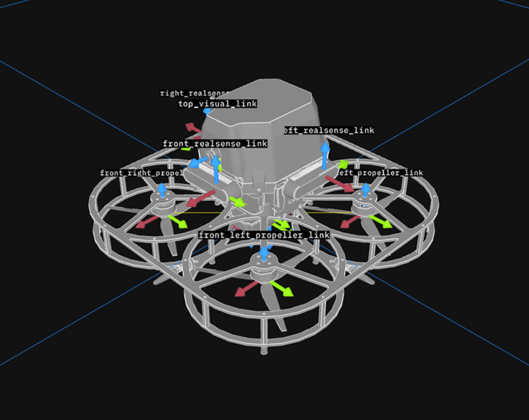

# arid_description

This package holds the xacro description and meshes for the ARID quadrotor.



- `xacro/arid.xacro`: the full robot description.
- `meshes/arid_model.stl`: the visual mesh; collision is an inline `<box>`.
- `launch/display.launch.py`: `robot_state_publisher`, with optional GUI and RViz.
- `rviz/arid.rviz`: the default RViz config.

`arid_description.service` runs the launch at boot, publishing the latched `/robot_description`
expanded URDF and the `/tf_static` fixed-joint tree.

## Launch arguments

| Arg | Default | Function |
|---|---|---|
| `rviz` | `false` | Opens RViz with `arid.rviz` preloaded. |
| `gui` | `false` | Starts `joint_state_publisher_gui`; no effect, since all joints are fixed. |

To view the model on the NoMachine desktop while the boot instance is already running, launch a
second instance with RViz:

```bash
ros2 launch arid_description display.launch.py rviz:=true
```

## Xacro structure

Three properties drive the geometry.

| Property | Value | Meaning |
|---|---|---|
| `mesh_scale` | `0.0001` | The STL is in millimetres and the URDF in metres. |
| `propeller_span` | `0.0975` | Propellers sit at `(±span, ±span)`. |
| `realsense_z` | `0.092042` | Z-offset of the front RealSense from `base_link`. |

Two macros generate the repeated links: `propeller(name, x, y)` for the four rotors, and
`realsense(name, x, y, yaw)` for the front camera. The autopilot, bottom visual camera, flow,
rangefinder and LiDAR links are inlined so their joint names stay fixed.

## Frames

```
base_footprint
└── base_link
    ├── autopilot
    ├── front_left_propeller_link   front_right_propeller_link
    ├── rear_left_propeller_link    rear_right_propeller_link
    ├── front_realsense_link
    ├── rslidar_link
    ├── bottom_visual_link
    ├── flow_link
    └── rangefinder_link
```

All joints are fixed. `front_realsense_link` sits at the left IR lens, following the
`realsense-ros` convention. `bottom_visual_link` is the down-facing CSI camera, with optical z
along body -z. `rslidar_link` is the RSAIRY mount frame.

## Visualization in Foxglove

Start the Foxglove bridge and connect Studio to `ws://<device-ip>:8765`. Load the URDF from
`/robot_description` and set the panel frame to `base_link`.

```bash
foxglove_bridge
```

## License

Apache-2.0: see [LICENSE](LICENSE).
